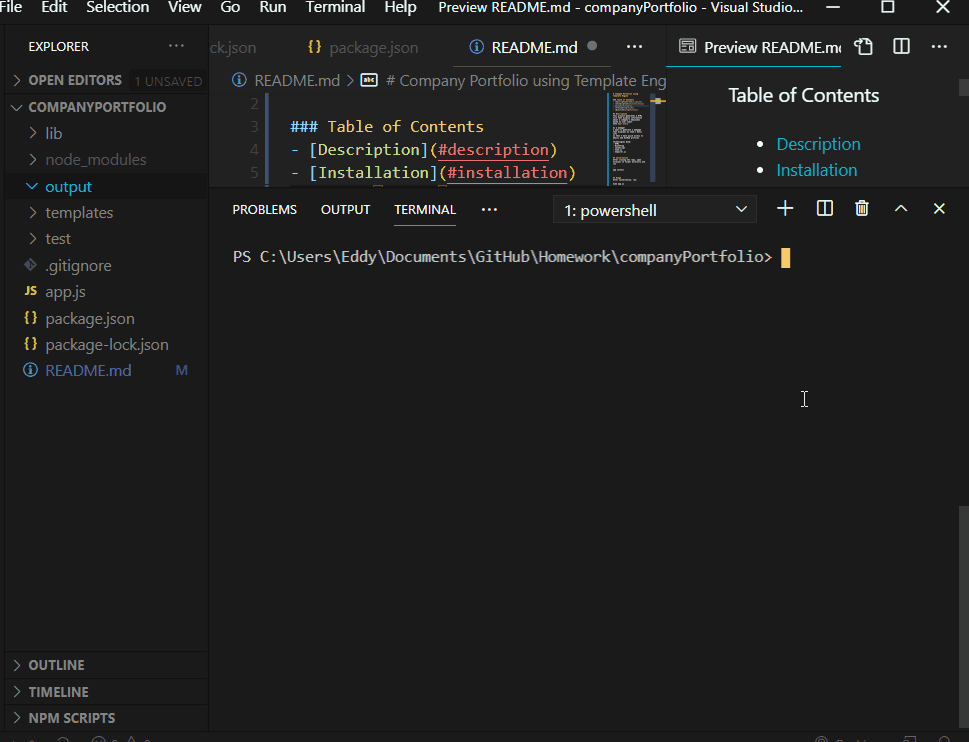

# Company Portfolio using Template Engine

### Table of Contents
- [Description](#description)
- [Installation](#installation)
- [Usage](#usage)
- [Preview](#preview)
- [Questions](#questions)

## Description
This project generates a HTML file that display information about a company's employees based on user input.
#### User Story
```
As a manager
I want to generate a webpage that displays my team's basic info
so that I have quick access to emails and GitHub profiles
```
Technologies Used:
- HTML
- BootStrap
- JavaScript
- node.js
- Inquirer.js


## Installation
After cloning the repo, open terminal in folder directory and run

```
npm install
```


## Usage
After installation, run: 
```
node app.js
```
You will be prompted questions about employess in a company, answers these questions and a output folder container the HTML file will appear, if successful.


## Preview 

## Questions
GitHub: [Eddy's Github](https://github.com/eddyangang)


